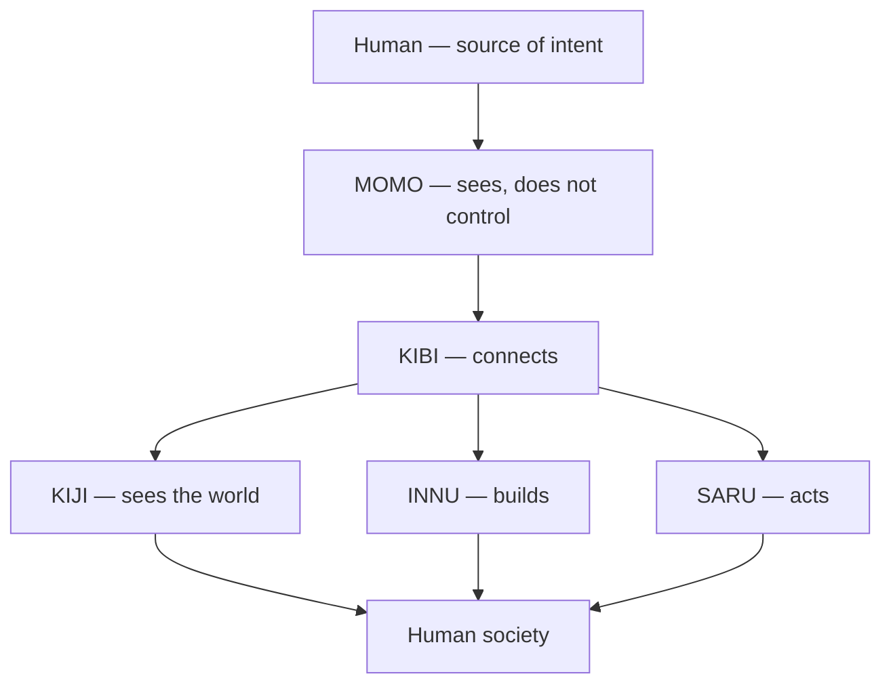

  

<h1 align="center">Project 桃多郎</h1>

<strong>Human intent enters here.</strong>

  <em>MOMO sees the whole, but does not control the whole.</em> 
  全部を見る。でも全部は動かさない。

<strong>MOMO ≠ Human.</strong> Human is the source. MOMO is the closest system representation of that intent.

  <a href="https://asklessquill.github.io/MOMO/"><strong>Explore MOMO →</strong></a>

The public Human-facing view lives on [GitHub Pages](https://asklessquill.github.io/MOMO/). This README is the door, not the whole house.

## The shape

  

This is the intended direction, not a finished architecture. Current KIBI still holds the constitution. Formal separation has not happened.

## Read further

- [GitHub Pages](https://asklessquill.github.io/MOMO/) — Human-native interface
- [GENESIS.md](GENESIS.md) — why this vessel was opened
- [MONITORING.md](MONITORING.md) — the watching boundary
- [Principle 9](docs/principle-9.md) — recomposition, both ways
- [Story](docs/story.md) — why the public face looks like this

Current operational status is not published here.

Technical boundary

This is a public repository. Do not put secrets, credentials, tokens, private tenant data, or private operational state here.

MOMO is not a supervisor. It does not own KIJI, INNU, or SARU internals. It does not ratify a new Constitution on this page.

Current KIBI remains the Human-ratified constitutional text until Human decides otherwise.

Private Human and AI observatory views are projections of source repositories. They are not linked from here as live status, because they are not public.

