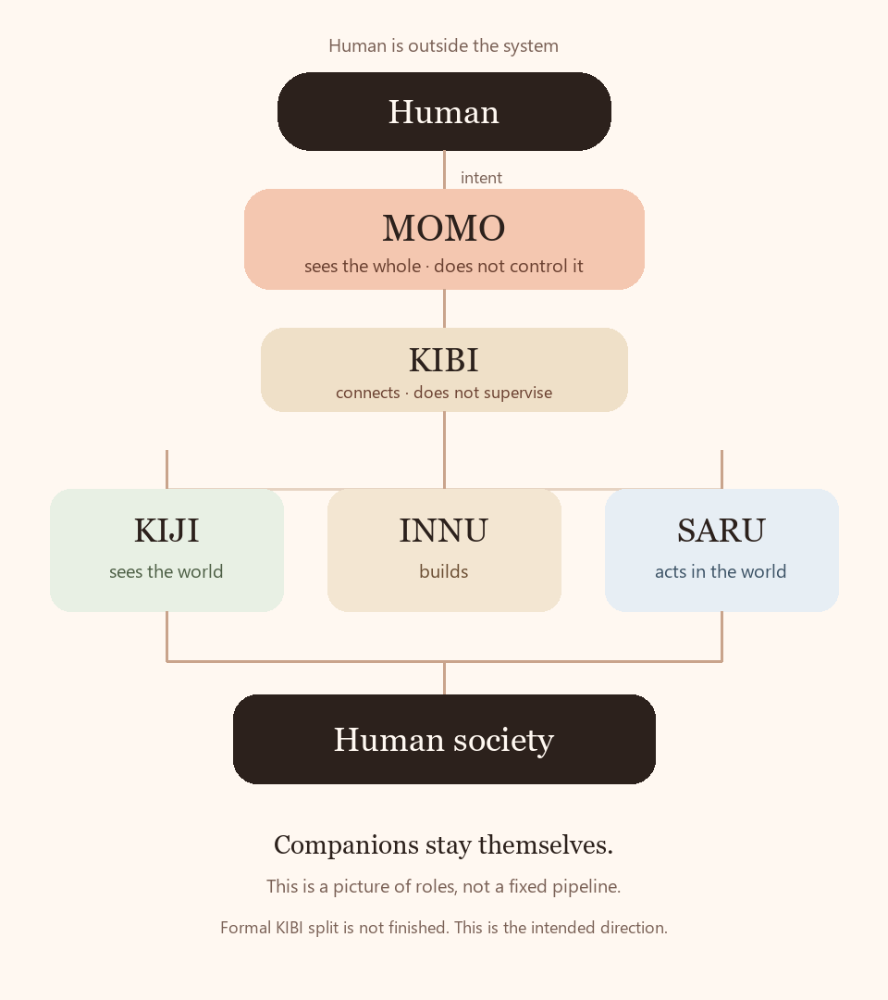
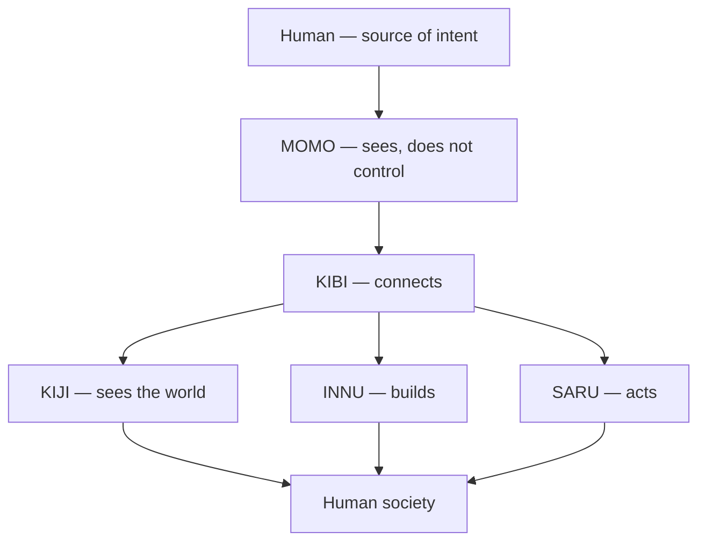
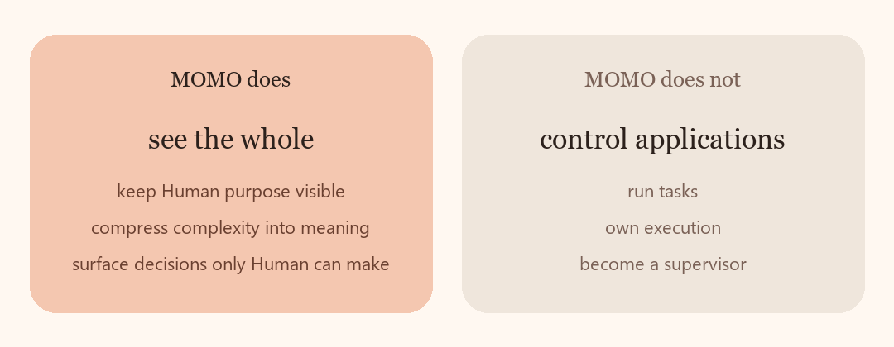
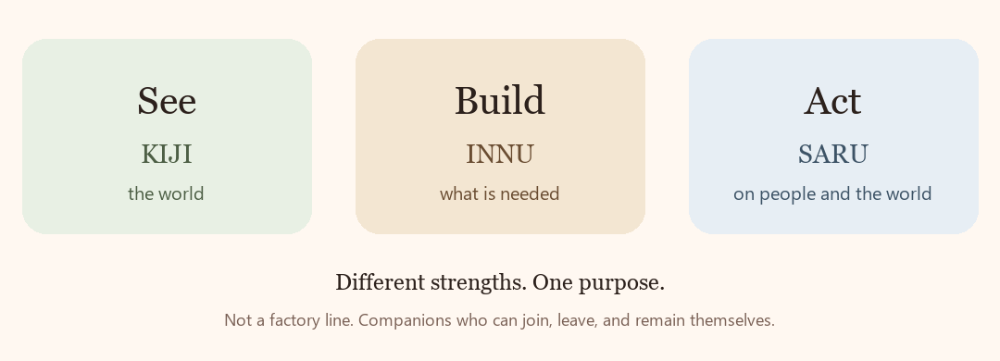

  

<h1 align="center">Project MOMO</h1>

  
  
  

<strong>Human intent enters here.</strong>

  MOMO watches the whole system, 
  keeps it aligned with purpose, 
  and explains its meaning back to Human.

  <em>MOMO sees the whole, but does not control the whole.</em> 
  全部を見る。でも全部は動かさない。

<strong>MOMO ≠ Human.</strong> Human is the source. MOMO is the closest system representation of that intent.

## The map

Before the sentences, the shape:

  

This is the intended direction, not a finished architecture. Current KIBI still holds the constitution. Formal separation has not happened.

## What MOMO does

  

MOMO is not a command tower. It is an observatory.

Applications remain themselves. MOMO does not run their work, approve their routine, or enter their internals.

## The companions

  

| | | |
|---|---|---|
| **KIJI** | sees the world | finds what matters outside |
| **INNU** | builds | turns need into something real |
| **SARU** | acts | changes people and the world |

KIBI is the place that lets different strengths connect. It is not a fourth worker, and not a boss.

These are roles, not a factory line. Companions may join, leave, or be replaced. The picture above is for understanding, not a strict runtime pipeline.

## How meaning moves

Human speaks in purpose.

MOMO holds that purpose close, watches whether the whole is still facing it, and answers at Human scale:

1. What happened
2. What is confirmed
3. What is next
4. Where things stand
5. What only Human may decide

Detail stays available. It is not the first thing Human has to read.

## Principle 9, made visible

A Human-facing system should not be imitated as a screen.

An AI’s insides should not be poured back onto Human.

  

This repository is that second motion, done on GitHub itself.

[See the short essay.](docs/principle-9.md)

## How this public place grew

  

[The story.](docs/story.md)

## Explore deeper

- [GENESIS.md](GENESIS.md) — why this vessel was opened
- [MONITORING.md](MONITORING.md) — the watching boundary
- [Principle 9](docs/principle-9.md) — recomposition, both ways
- [Story](docs/story.md) — why the public face looks like this

Current operational status is not published here. This place says what the system is, how it is designed, and why it exists.

Technical boundary

This is a public repository. Do not put secrets, credentials, tokens, private tenant data, or private operational state here.

MOMO is not a supervisor. It does not own KIJI, INNU, or SARU internals. It does not ratify a new Constitution on this page.

Current KIBI remains the Human-ratified constitutional text until Human decides otherwise.

Private Human and AI observatory views are projections of source repositories. They are not linked from here as live status, because they are not public.

