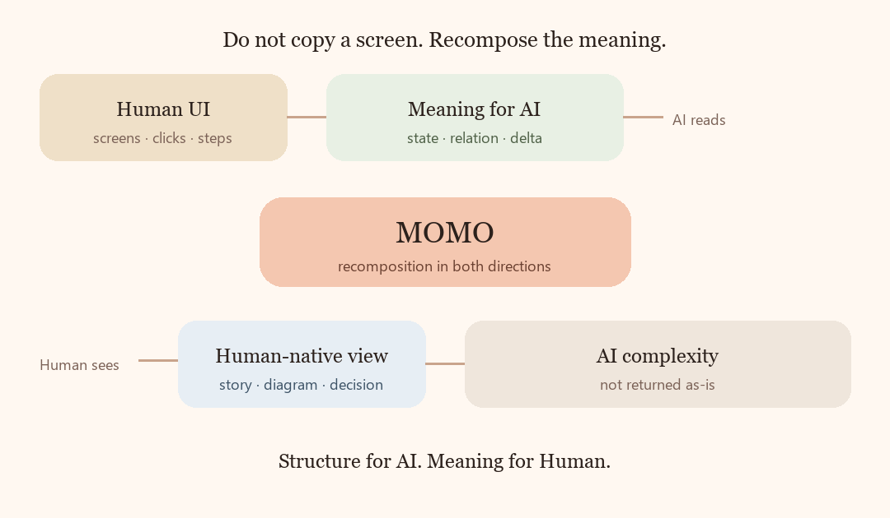

# Principle 9, shown rather than copied

This page is a Human-facing picture of a thought that already exists in current KIBI.

It is **not** a new Constitution. It does not ratify, move, or rewrite Canonical Principles. Formal transfer still waits for Human.

The thought has two sides.

## Side one — for AI

Do not make AI click Human screens.

Take a Human-facing system apart into meaning: objects, relations, state, versions, events, authority, evidence. Give AI those, not the menu.

## Side two — for Human

Do not give Human the AI’s insides.

Take repository-scale complexity apart into meaning: a picture, a short story, a decision. Give Human those, not the task graph.

```text
Human UI
   ↓
meaning for AI
   ↓
         MOMO
   ↓
Human-native view
   ↓
AI complexity (kept back)
```

<p align="center">
  
</p>

This public repository is the second side, done on GitHub itself.

Private work stays private. This page shows the idea, not an operational status.
