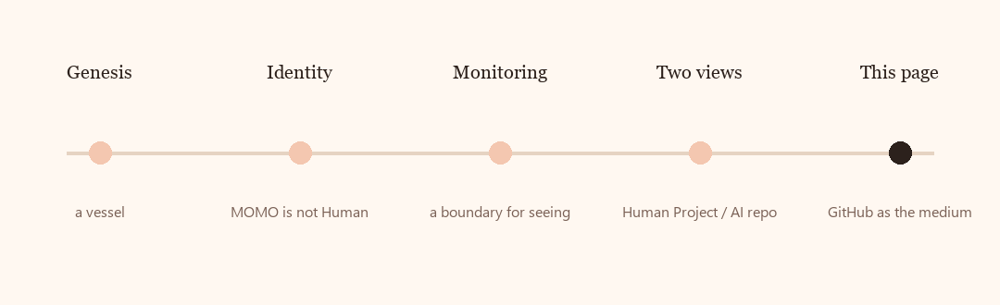

# Why this public place looks like this

MOMO did not start as a landing page.

It started as an empty vessel: a public home that could later receive Purpose, Constitution, and Principles after KIBI’s strengthening. That transfer has not happened.

Then Human said: MOMO is not Human. MOMO watches the whole, and does not control it.

Then Human said: the Human view of the whole lives in a private GitHub Project. The AI view lives in a private repository. This public place keeps the philosophy.

Then Human said: GitHub itself should be the Human-facing medium. Not a separate website.

Then the public face moved from this README onto [GitHub Pages](https://asklessquill.github.io/MOMO/). The repository still holds the words. The page holds the first look.

  

The older records remain:

- [GENESIS.md](../GENESIS.md) — why the vessel was opened
- [MONITORING.md](../MONITORING.md) — how watching is bounded

This page is the story of the public face, not a live status board.
